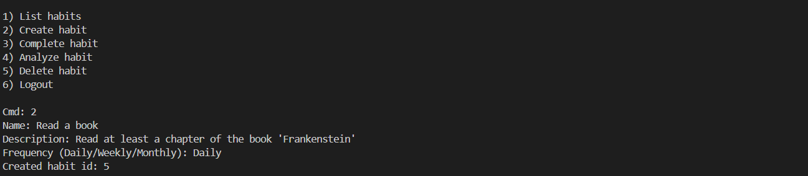

# Hexis - Habit Tracker (Python CLI Application)

## Overview

Hexis is a Habit Tracker python application that was built in a modular fashion and allows users create, manage, and analyze habits over time using the command-line interface. The system supports **daily, weekly, and monthly habits**, tracks completions using time-series data, and provides analytics such as streak calculations that respect each habit’s periodicity.

This application uses an SQLite database for storage and includes a comprehensive unit test to validate its functionality and the logic in the program. 

Hexis was developed to demonstrate clean software design, modularity, and test-driven development and is a fufillment of the last phase of the course **Project: Object Oriented and Functional Programming with Python** in the learning program **Applied Artificial Intelligence** by the **International University of Applied Sciences, Germany (IUGMBH)**.


## Hexis Features

* User registration
* Create, edit, list and delete habits (CRUD operations)
* Support for **daily**, **weekly**, and **monthly** habits
* Mark habits as completed on specific dates
* Automatically calculate streak based on habit periodicity and has an analytics module for habit performance(longest streak and current streak)
* Fully unit-tested using predefined time-series data

## Technology Used
* Language: Python 3.13
* Database: SQLite (sqlite3)

## Project Structure

```
habit-tracker/
│
├── habit/   
│   ├── app.py            # Application entry point (CLI logic)
│   ├── tracker.py        # Core habit tracking & persistence logic
│   ├── database.py      # Containing the SQL database logic
│
├── tests/
|   ├── __init__.py
|   ├── conftest.py      # setup of temporary directory to run the tests
|   ├── tests_data.py     # four weeks worth of data 
│   ├── test_app.py       # App-level tests
│   ├── test_habits.py    # Habit CRUD tests
│   ├── test_analytics.py # Streak and analytics tests
│
├── requirements.txt
├── README.md
└── .gitignore
```

The codebase is intentionally split into different logical modules for better  readability, maintainability, and scalability.

## Requirements
* Python 3.9+
* Git
* Virtual environment tool (venv or virtualenv)

## Analytics Module & Logic

The analytics module provides:

* Daily streak calculation
* Weekly streak calculation
* Monthly streak calculation
* Streak validation using **4 weeks of predefined habit data**

Streak calculations strictly follow habits' periodicity. A daily habit requires consecutive daily completions, while a weekly habit requires one completion per week (consecutive 7-day intervals).


## Unit Testing

This project includes unit tests that cover:

1. Habit CRUD operations: Creation, listing, deletion, and completion
2. Analytics module: Daily streak calculation (over 4 weeks) and weekly streak calculation (4 weeks) 
3. Application Flow: User registration -> habit creation -> habit completion -> analytics retrieval.

To run the tests:

```bash
pytest -v
```


## Steps to Run the Application

1. Clone the repository:

```bash
git clone <repository-url>
cd hexis
```

2. Create and activate a virtual environment:

```bash
python -m venv venv
source venv/bin/activate  # Windows: venv\Scripts\activate
```

3. Install dependencies:

```bash
pip install -r requirements.txt
```

4. Run the application:

```bash
python -m habit.app
```

## Screenshots


## How to Use Hexis
1. Run the application in the virtual environment that was previously created. 
```bash
python -m habit.app
```

2. Register or Login using your crdentials.


3. Create a Habit, inputing a title, a description, and preferred frequency.


4. Analyze habit and see progress


